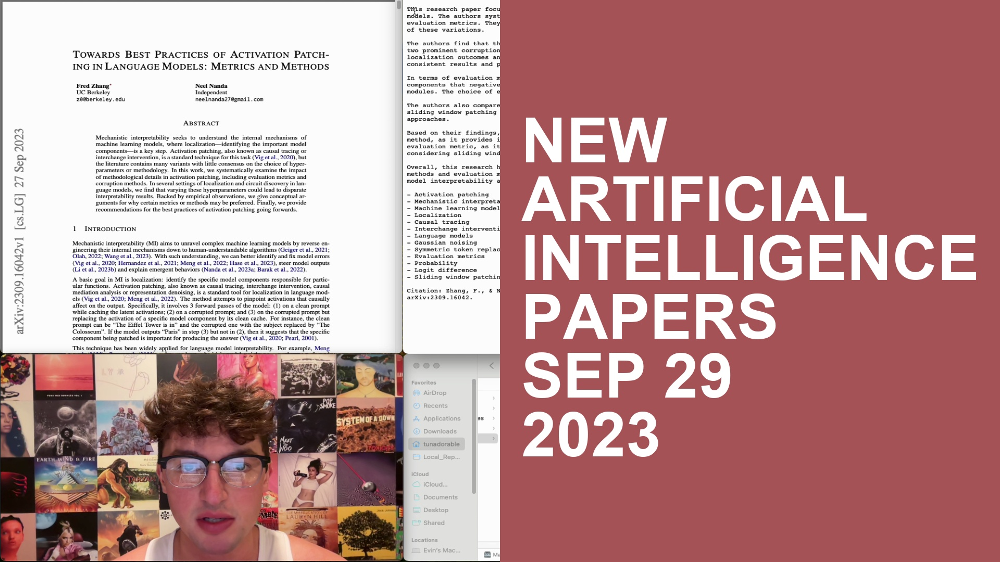

# daily-thumbnail

This is for public access to how I automatically generate simple boring thumbnails for my video daily AI paper breakdowns on YT. 
I don't think anybody will really find it useful but who knows.
No real plan to bring the readme up to date unless I find that people actually start using & caring about this, so in the meantime I've left the old readme intact below.

## Repo Contents

- `daily-thumbnail.py` - does everything. basically takes a screenshot from a few seconds into the video (my opening screen isn't as idea), then overlays the right half of the screen with a random color and some text
- `arialbd.tff` - just so i don't have to figure out where this file actually exists on my system

## SETUP

1. Clone the repository to your local machine.
2. Install the required Python packages by running `pip install -r requirements.txt` in your terminal.

## USAGE

Run the `daily-thumbnail.py path/to/input_movie.mov --text "Alternate\nTitle\nString` script to generate the image. First argument is filepath, second argument is an optional alternate title. No guarantees that the alternate file you put in will fit nicely, but you can use "\n" to designate new lines.

## NOTE

This script is not designed to handle errors or really be useful to anyone else. This repo is basically just me learning how to make a github repo.
